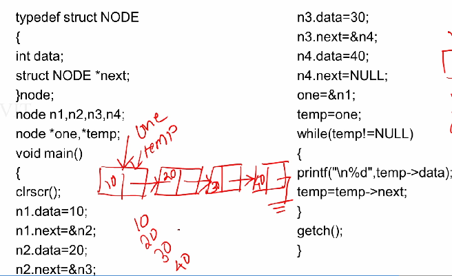

**Implementation of singly linked list**

Singly linked list is a collection of node where each node consists of data and next address field.

keyword is struct.

all operation can be performed in singly linked list, insertion, deletion, sorting, merging, etc..

pseudo code:

void CREATE_NODE(value){
    Create a new node
    Set the node's data to value
    Set the node's next pointer to NULL
    Return the new node
}

void INSERT_AT_BEGINNING(head, value){
    Create a new node with value
    Set the new node's next pointer to head
    Set head to the new node
    Return head
}

void INSERT_AT_END(head, value){
    If head is NULL, create a new node and return it as head
    Traverse the list to find the last node
    Set the last node's next pointer to the new node
    Return head
}

void DELETE_FROM_BEGINNING(head){
    If head is NULL, print "List is empty"
    Set head to the next node of the current head
    Delete the old head
    Return new head
}

void DELETE_FROM_END(head){
    If head is NULL, print "List is empty"
    If head has only one node, delete it and set head to NULL
    Traverse to the second last node
    Set its next pointer to NULL and delete the last node
    Return head
}