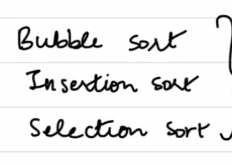

**shell sort:**

Sort with a gap, reducing the gap progressively until the entire array is sorted.

ShellSortOnePass(array, n, k):
    // Input: array of size n, increment factor k
    // Output: Display the array after one pass with gap k

    gap = k  // Set the initial gap to the given increment factor

    // Perform gapped insertion sort for this gap
    for i = gap to n - 1:
        temp = array[i]  // Store the current element
        j = i

        // Shift elements of the subarray to the right if they are greater than temp
        while j >= gap and array[j - gap] > temp:
            array[j] = array[j - gap]
            j = j - gap

        // Place temp in the correct position
        array[j] = temp

    // Display the array after one pass
    print(array)

Example Walkthrough:
Given array: [23, 3, 7, 13, 89, 66, 6, 44, 18, 90, 98, 57]
Gap (𝑘 = 3):

Group processing:

Group 1 (indices 0, 3, 6, 9): [23, 13, 6, 90] → [6, 13, 23, 90]
Group 2 (indices 1, 4, 7, 10): [3, 89, 44, 98] → [3, 44, 89, 98]
Group 3 (indices 2, 5, 8, 11): [7, 66, 18, 57] → [7, 18, 57, 66]
Merge back into array: After one pass, the array becomes: [6, 3, 7, 13, 44, 18, 23, 89, 57, 90, 98, 66]

real full complete shell sort:

ShellSort(array, n):
    // Input: array of size n
    // Output: Fully sorted array

    // Step 1: Initialize gap
    gap = n // 2  // Start with a large gap (half the array size)

    // Step 2: Perform sorting for each gap
    while gap > 0:
        // Gapped insertion sort for this gap
        for i = gap to n - 1:
            temp = array[i]  // Store the current element
            j = i

            // Shift elements in the group until the correct position is found
            while j >= gap and array[j - gap] > temp:
                array[j] = array[j - gap]
                j = j - gap

            // Place temp in the correct position
            array[j] = temp

        // Reduce the gap for the next pass
        gap = gap // 2

    // Step 3: Return the sorted array
    return array

Worst-case Time Complexity (Basic Sequence like Half-Gap): O(n^2)
Space Complexity: O(1)

**Merge sort**

1. Split the array into two halves.
2. Recursively sort each half using the same MergeSort function.
3. Merge the two sorted halves together by comparing each element and adding the smaller one to the result.

MergeSort(array):
    // Base case: if the array has 1 or 0 elements, return it
    if length of array <= 1:
        return array

    // Step 1: Split the array into two halves
    mid = length of array // 2
    left_half = array[0...mid-1]
    right_half = array[mid...end]
    
    // Step 2: Sort each half by calling MergeSort recursively
    left_half = MergeSort(left_half)
    right_half = MergeSort(right_half)
    
    // Step 3: Merge the sorted halves
    result = []
    i = 0, j = 0
    
    // Merge both halves by comparing elements
    while i < length of left_half and j < length of right_half:
        if left_half[i] < right_half[j]:
            add left_half[i] to result
            i = i + 1
        else:
            add right_half[j] to result
            j = j + 1
    
    // Add any remaining elements from both halves
    while i < length of left_half:
        add left_half[i] to result
        i = i + 1
    
    while j < length of right_half:
        add right_half[j] to result
        j = j + 1
    
    // Return the merged and sorted array
    return result

**Heap sort**

HeapSort(array):
    // Step 1: Build a Max-Heap from the array
    n = length of array
    for i from n // 2 - 1 to 0:
        Heapify(array, n, i)

    // Step 2: Extract elements from the heap one by one
    for i from n - 1 down to 1:
        // Swap the root (maximum element) with the last element
        swap(array[0], array[i])
        
        // Call Heapify on the reduced heap
        Heapify(array, i, 0)

Heapify(array, n, i):
    largest = i
    left = 2 * i + 1
    right = 2 * i + 2

    // If left child is larger than root
    if left < n and array[left] > array[largest]:
        largest = left

    // If r ight child is larger than the largest so far
    if right < n and array[right] > array[largest]:
        largest = right

    // If largest is not root, swap and continue heapifying
    if largest != i:
        swap(array[i], array[largest])
        Heapify(array, n, largest)

**Quick sort**

QuickSort(A, low, high): This is the main function that recursively sorts the array. It first calls the Partition function to find the pivot's correct position and then sorts the subarrays to the left and right of the pivot.
Partition(A, low, high): This function partitions the array around the pivot element, placing elements smaller than the pivot to its left and elements greater to its right, then returns the pivot’s final position.
Swap: This is a simple operation that exchanges two elements in the array.

QuickSort(A, low, high):
    if low < high:
        pivotIndex = Partition(A, low, high)
        QuickSort(A, low, pivotIndex - 1)  // Recursively sort left subarray
        QuickSort(A, pivotIndex + 1, high) // Recursively sort right subarray

Partition(A, low, high):
    pivot = A[high]  // Choose the last element as the pivot
    i = low - 1      // Index of smaller element
    for j = low to high - 1:
        if A[j] <= pivot:
            i = i + 1
            Swap A[i] and A[j]
    Swap A[i + 1] and A[high]
    return i + 1  // Return the index of the pivot
